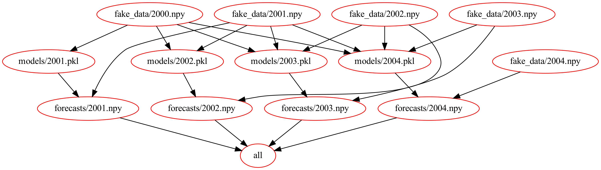

# In the beginning...there was `make`

## DAG Menagerie
Whole plethora of DAG runners these days

    - Airflow
    - Azkaban
    - d6tflow
    - Dagster
    - Dask
    - Doit
    - Kubeflow
    - Luigi
    - Oozie
    - Prefect
    - SCons
    - Snakemake

The `make` utility function was created in the 1970s by an intern at Bell Labs. One of the original `luigi` [presentations](https://www.slideshare.net/erikbern/luigi-presentation-nyc-data-science) cites `make` as the inspiration for the library interface.

A common misconception is that `make` is a build tool for C/C++. It is that. But it's also much more general. It can be used for orchestraing arbitrary DAGs.

## Simplest research workflow
- Create data for every year
- Train a model for each year on increasing subsets of data (e.g. model for 2012 is trained on all data _before_ 2012)
- Use each model to make forecasts

### V1
[Here](makefiles/MakefileV1.mk) is a simple makefile that encapsulates the described research workflow.

Each component of the Makefile is called a _rule_. Each one is of the form
```
<target> : <prereq_1> ... <prereq_n>
    <action>
```

A *target* is the file to be created or built. This is the equivalent of the `output()` method in luigi.

To the right of the colon are the _prerequisites_. This is equivalent of the `requires()` method in luigi.

The *action* is indented on the line below (there can be multiple). This is the equivalent of the `run()` method in luigi.

Running 

```make -f MakefileV1.mk forecasts/2003.npy```,

for example, will create model data from 2000 to 2003, build a model trained on years 2000, 2001, and 2002, then make forecasts for 2003.

### V2
By default running `make` without arguments will just execute the first target. In this case, it will be equivalent to running 

```make fake_data/2000.npy```

We can introduce a target `all` so that we don't have to run `make` on every single target. Unlike the other targets, this doesn't correspond to a file to be created so it's given a special *phony* designation.

`clean` is another common target to have in a Makefile to force a fresh run of the DAG by removing all completed targets. Similar to `all`, it is a phony target in the sense that it doesn't correspond to an actual build artifact. The [second iteration of the makefile](makefiles/MakefileV2.mk) allows us to run the entire DAG with 5 key strokes!



### V3
[Version 3 of the makefile](makefiles/MakefileV3.mk) uses variables to remove some of the hardcoded constants that appeared in previous versions. In the event we wanted to change the output directory of the forecasts, we would have had to make the change several places. 

The value of a variable is accessed as `$(VAR_NAME)`. The `variables` target in this makefile is just there to help check we got the right things in the variable.

### V4
`make` is its own DSL and as such has a load of special characters. The most important are
```
out.o: src.c src.h
  $@   # "out.o" (target)
  $<   # "src.c" (first prerequisite)
  $^   # "src.c src.h" (all prerequisites)
```

We can use this to simplify the plotting rule in [version 4](makefiles/MakefileV4.mk)

### V5 
The data pulling rules all follow a very simple pattern. This is significantly simplified using makefile wildcards and pattern substitutions in [verion 5](makefiles/MakefileV5.mk).

### V6
Similarly, the forecast targets are all very similar (though slightly more complicated). These are reduced with a slightly more complex `make` pattern in [version 6](makefiles/MakefileV6.mk).

### V7
The dependencies of the fitting code are much more complicated as they require increasing number of dependencies as a function of the year. This can also be compressed with some exceedingly clever functionality hidden away in `make` called _secondary expansion_. This is implemented in [version 7](makefiles/MakefileV7.mk)

### V8 
Conspicuously absent from our dependencies is the actual code! If you change anything in `data.py`, `modeling.py` or `forecast.py`, the `make` utility will not rerun any of the targets. Adding the source files as dependencies of the appropriate targets in [version 8](makefiles/MakefileV8.mk) creates a new DAG which is dependent on the code itself and not just the artifacts created


### V9
Similar to C++, makefiles allow the use of an `include` macro. [Version 9](makefiles/MakefileV9.mk) significantly cleans things up by pulling out many of the constants to a separate `config.mk` file.

## Conclusion
`make` is a generic DAG orchestrator. You can create some [remarkably complicated DAGs](https://github.com/lindenb/makefile2graph#gallery) if you know what you're doing.

## References:
[Makefile tutorial](https://swcarpentry.github.io/make-novice/)

[Common Makefile patterns](https://devhints.io/makefile)

[GNU Make manual](https://www.gnu.org/software/make/manual/make.html)
